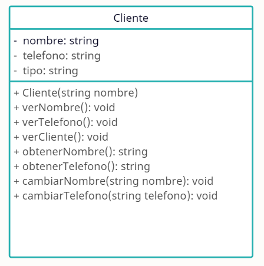
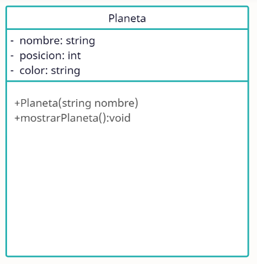

# Programación orientada a objetos.

Existen varios paradigmas en la programación tales como:
1. Estructurado, imperativo o procedimental.
2. Funcional.
3. Declarativo.
4. Orientado a los negocios.
5. Orientado a eventos.
6. Reactivo.


*La programación orientada a objetos es un paradigama de varios.*

**Un paradigma es una forma de solucionar los problemas con programación.**

> Pilares de la programación OO.

1. Abstracción.
2. Encapsulación.
3. Herencia.
4. Polimorfismo.

> Ejemplo de abstraccion:
```
  o
 -|-
 / \
 ¿Qué representa esto?
 R: una persona.
 ```

> Ejemplo de encapsulamiento:
```
 Atributos: (caracteristicas)
 nombre, apellido, telefono y email.
 Métodos: (comportamiento)
 verNombre(), verApellido(), verCliente()

int x; // Crea una variable de tipo entero.
double monto; // Variable de tipo doble.
Cliente c1 = new Cliente(); // Se crea un cliente.
```
> Ejemplo de herencia

Abuelito:

    -Casa
    -Auto
    -Garage
    -Dinero
    -Locales
    -Mascota

Nieto:

    -Macbook
    -Motocicleta
    -Muebles
    -Auto
    -Bicicleta


Al momento de heredar:
Nieto:

    -Macbook
    -Motocicleta
    -Muebles
    -Auto
    -Bicicleta
    -Casa
    -Auto
    -Garage
    -Dinero
    -Locales
    -Mascota

Ejemplo con POO:

clase Usuario:

    -nombre
    -telefono
    -email
    -direccion 

subclase Deportista deriva de Usuario:

    -nombre
    -telefono
    -email
    -direccion 
    -deporte
    -logros

subclase Doctor deriva de Usuario:

    -nombre
    -telefono
    -email
    -direccion 
    -especialidad
    -clinica
    -horarios

> Ejemplo de polimorfismo:
```
U1.mostrar();
nombre: Pepe
email: pepe33@gmail.com

DEP1.mostrar();
nombre: Carlos
email: car10@gmail.com
deporte: atletismo

DOC1.mostrar();
nombre: Alan
email: alan91@gmail.com
especialidad: cardiología
```

> Diagramas UML

La POO se puede modelar con diagramas UML, básicamente nos dan un panorama general de como va a quedar una clase, un sistema, etc.

* Ejemplo 1:


* Ejemplo 2:


```cpp
class Planeta{
    private:
        string nombre;
        int posicion;
        string color;
    public:
        Planeta(string _nombre);
        void mostrarPlaneta();
};

```

Haz la siguiente tarea:
```
Crear el diagrama UML de la clase Automovil, con al menos 5 atributos y al menos 3 métodos.

Después crear 10 instancias de la clase Automovil y entonces mostrarlos como un catálogo.

```


